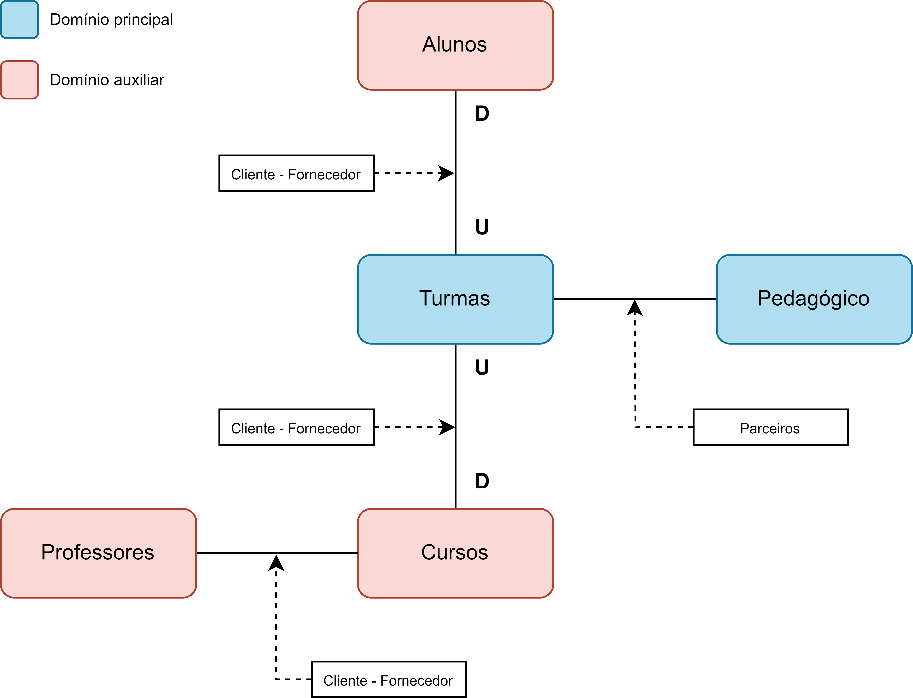

# Projeto Gestão Acadêmica

## Conceitos
Este projeto de software segue uma modelagem orientada pelas técnicas de domain-driven design.
Trata-se de uma aplicação monolítica modular, dividida pelos diferentes contextos identificados na modelagem.
A arquitetura implementa os padrões de divisão em camadas, CQRS, repositório e comunicação por eventos.

## Tecnologias
Tecnologias utilizadas neste projeto:
- C#
- ASP.NET 8
- Entity Framework
- MediatR
- FluentValidation

## Diagrama de Contexto
](https://raw.githubusercontent.com/vctr-moraes/GestaoAcademica/refs/heads/master/artifacts/diagrama%20de%20contexto.png)

## Super-Linter Badge

